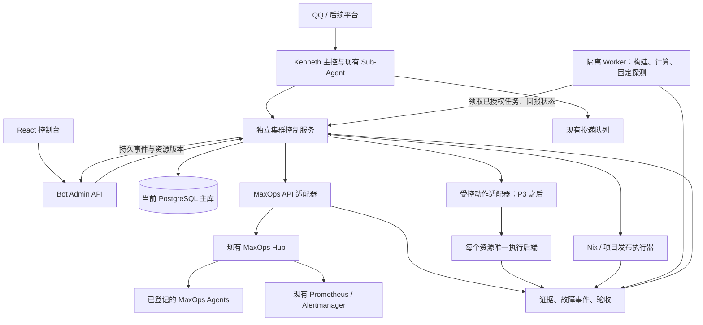

# Kennethbot 八节点协作与远程运维完整方案：MaxOps 集成版

日期：2026-09-06。设计基线：Kennethbot 0.11.3，Bot 提交 `13accb2`，Nix 配置提交 `327cd3e`。

修订：第 2 版，明确复用 MaxOps，收窄自建节点程序职责。基线来自本次读取的本地源码和配置，不等于重新确认了所有生产节点的运行状态。

状态：分阶段实施中。`0.16.0` 已完成 P0-P2、P3 的持久操作合同底座、P4 的首个隔离 Worker，以及 P5/P6 的借用调度、检查点、故障记忆和目标守护代码。`0.17.0` 已完成 P7 固定提交部署的控制面、独立执行器、管理界面和 NixOS module。`0.17.2` 进一步收紧 P5/P6：跨所有者借用改为服务端强制授权；守护目标绑定登记信息并固定创建时快照；需要人工关注的守护仍持续探测，恢复后自动关闭对应事故。P3 在生产仍保持不可执行：MaxOps 当前只读，且尚未批准唯一写后端，因此控制台会明确显示 `not_configured`，不会用 SSH 或任意 root shell 冒充。P5/P6 仍需随共享 Nix 配置部署并用真实 Worker、PostgreSQL 和 QQ 投递验收；P6 控制台当前只开放观察型守护，自动修复必须等待 P3 唯一写后端获批。P7 代码尚未部署，必须在独立主机配置部署凭据并完成真实预检、批准、切换与回滚验收后才能写成线上能力。

实现记录：

| 阶段 | 代码状态 | 生产状态 | 仍需完成 |
| --- | --- | --- | --- |
| P0 资产与合同 | Bot 侧合同和拒绝边界完成 | 待同步共享 registry | 确认八台维护者、站点、observe/operate/compute 与逐机服务范围 |
| P1 只读接入 | 控制服务、数据库迁移、工具、指标和控制台完成 | 待配置专用身份和部署 | 独立凭据、共享 MaxOps grant、h610 启用、真实八节点验收 |
| P2 实验式排障 | 六类固定模板、结构化证据与两层检查完成 | 已在 h610 使用 | 继续扩展获准节点与真实案例 |
| P3 远程操作 | 合同、签名身份、审批、事件、幂等、租约与对账底座完成 | 写后端未批准，保持 `not_configured` | 维护者验收唯一写后端后才开放指定服务动作 |
| P4 Worker/预览 | 独立 Worker、资源预留、fencing、断线回执、产物哈希和静态预览完成 | 待本次 h610 部署验收 | 再按节点授权逐台扩展，不复用管理凭据 |
| P5 借用调度 | 所有者策略、available/draining/unavailable、限时授权、预算预留/结算、优先级与检查点恢复完成 | 待随 0.16.0 部署验收 | 用真实 Worker 验证撤权、超分拒绝、GPU 拒绝和跨租约恢复 |
| P6 故障记忆/守护 | 事故生命周期、带证据案例、BGE-M3 混合检索、适用性复核、确定性守护状态机完成 | 待随 0.16.0 部署验收；自动修复保持关闭 | 验证健康路径零模型调用、期限和次数上限；写后端获批前只观察 |
| P7 固定版本部署 | 两阶段合同、Git/flake 校验、闭包预览、独立部署器、分批验收和受限回滚完成 | 未部署 | 在非目标主机配置独立凭据，真实验证预检、批准、切换、取消和回滚 |

建议阅读顺序：第 1-5 节了解整体；第 6-10 节看五个功能怎么用；第 20 节看先做什么。第 11-19 节是实施时需要的接口、数据库、权限和失败处理细节。

一句话：**MaxOps 负责可信的服务器查询与其正式支持的受控运维接口，Kennethbot 负责理解目标、协作分析、授权编排、计算任务和结果交付；Prometheus、Nix、现有数据库各自继续做好原来的工作。**

本次相对上一版的调整：

| 原方案中可能重叠的部分 | 本版决定 |
| --- | --- |
| 自建 Node Agent 同时查状态、查日志和操作 systemd | 取消通用自建运维 Agent，先复用 MaxOps agent；确有缺口才做狭窄的执行扩展 |
| Kennethbot 再登记一套服务器和运维能力 | 主机标识源于 Nix registry；MaxOps 拥有其运维目录，Kennethbot 只保存投影及任务专属策略 |
| 一份本地注册表定义所有操作 | 各后端拥有自己的接口定义；Kennethbot 做版本化映射、收紧权限和任务验收，不复制上游定义 |
| 新的服务变更默认由 Kennethbot 自己执行 | 优先复用经确认的 MaxOps 写接口；当前未实现就不开放，独立扩展必须获准并明确唯一执行归属 |
| 监控和事件分别采集、分别通知 | 复用已有指标与告警来源；Kennethbot 负责调查关联，按事件去重通知 |
| 接入 MaxOps 就能管理全部机器 | 先添加 Kennethbot 独立只读身份，再逐台登记；算力节点不必同时开放运维权限 |

全文目录：

| 章节 | 内容 |
| --- | --- |
| 1-4 | 产品目标、五个特色、已有基础与复用边界、八节点分工 |
| 5 | 完整架构与 MaxOps 接入合同 |
| 6-10 | 排障、临时项目、算力借用、故障记忆、目标守护 |
| 11-15 | 授权、失败处理、部署、工具/API、存储 |
| 16-19 | 控制台、模型成本、故障边界、代码布局 |
| 20-22 | 实施顺序、验收方法、交付清单与参考 |

## 1. 我们最终要做成什么

你在 QQ 或控制台交代一件事，Kenneth 能调动获得授权的服务器完成它，知道执行到了哪里，检查结果，并把有用的经验留下来。

日常使用可以是：

> “为什么千问又连不上？你从几台机器分别查一下。”
>
> “做个今晚聚餐的投票网站，明天自动关闭，结果给我留下来。”
>
> “这个视频明早给我分析，尽量用本地模型，别抢同学正在用的 GPU。”
>
> “把机器人更新到最新提交，先检查会不会影响其他人的服务。”
>
> “今晚演示期间看住这个网站，只允许重启一次，恢复不了就通知我。”

普通聊天、模型调用、文件交付和原有 Sub-Agent 继续工作。集群功能通过自然语言触发 Tool Call，斜杠命令只作为快捷入口。不会给每条群消息增加一次集群分析，也不会因为接入八台机器就常驻八个 LLM。

## 2. 五个特色及其可检验的价值

这些是相对于当前 Kennethbot 和参考部署的产品改进，不宣称是行业首创。

| 特色 | 用大白话解释 | 实际新增能力 | 怎么证明有用 |
| --- | --- | --- | --- |
| 实验式排障 | 先猜几个原因，再挑能区分原因的检查 | 多节点探测、结构化证据、按结果追加检查 | 同一案例能排除错误原因，并减少无效操作 |
| 临时项目 | 一句话生成能访问的项目，到期收尾 | 代码交付、预览部署、有效期、转正式服务 | 创建、访问、关闭、保留结果全部有记录 |
| 借用算力 | 有空帮忙，人要用时让路 | 资源授权、排队、检查点、节点选择 | 借用到期后停止派新任务，不丢已提交成果 |
| 变更与故障记忆 | 知道谁改了什么，后来发生了什么 | Git/部署/指标/事件关联、带证据的案例检索 | 能找到实际相关变更，且不会把时间接近直接当因果 |
| 有期限的目标守护 | 交代一段时间内照看一项服务 | 可执行检查、预先授权的处理、恢复验收 | 正常时低成本运行，异常时按范围处理，达到限额即停止 |

共同原则：用户目标 -> 可执行任务 -> 观察结果 -> 调整行动 -> 验证 -> 留下记录。LLM 提出分析和步骤；程序负责身份、权限、状态、调度和实际执行。

## 3. 现有基础、MaxOps 现状与职责边界

### 3.1 Kennethbot 已有的基础

以下是代码中已有的能力，具体生产开关仍以实际配置为准。

| 现有模块 | 可以复用什么 | 集群阶段要补什么 |
| --- | --- | --- |
| `agent/registry.py` | 主控、运维、代码、媒体、文件、分析等专家 | 运维角色接入集群工具；每个检查任务保留独立会话 |
| `agent/execution.py`、`subagents.py` | 自动入口、任务拆分、依赖执行、验收和交付 | 远程执行合同、节点选择、跨机器结果关联 |
| `agent/sessions.py`、`agent/workspaces.py` | 子会话与任务工作区 | 远程工作区引用、跨节点产物移交 |
| `storage/jobs.py`、`workers/durable_jobs.py` | PostgreSQL 队列、租约、重试、取消 | 节点占用记录、远程执行回执、不确定结果对账 |
| `agent/scheduling.py` | 当前进程内的专家并发限制 | 跨进程、跨机器的资源预留；不能直接把内存计数器当集群调度器 |
| `tool_policy.py` | 工具风险、副作用、审批描述 | 具体操作合同与真实身份绑定，远程节点再次验证 |
| `alert_history.py`、`alert_notifier.py` | 告警生命周期和群通知 | 多条告警合并为故障事件，关联排障步骤与处理结果 |
| `admin_control.py`、React、SSE | 资源版本、修改记录、实时更新 | 集群页面、节点详情、变更预览、真实操作者归属 |
| 模型网关 | 模型能力、健康路由、实际模型记录 | 按排障或生成任务选择已验证模型，并保留费用与时延 |
| 现有 Outbox | 消息和文件投递、回执与不确定状态 | 集群任务完成后复用投递流程，不让节点自行往群里发文件 |

两个实施前必须正视的差距：

1. `operator` 目前主要查询 Bot 告警、沙盒和任务，没有完整的服务器操作接口。
2. `approval_from_user_text()` 主要从当前消息文字判断同意，不能直接承担八台机器的运维授权。新的远程变更必须有具体目标、动作、版本和操作者身份。原有本地工具可以继续使用现有机制，不一次性重写所有工具。

### 3.2 当前 MaxOps 到底有什么

参考 MAX 锁定提交 `4e9f934` 的 `src/Max/MaxOps/Client.hs`、`docs/runbooks/maxops.md`，以及共享 Nix 仓库的 `docs/maxops.md`。

- 已实现的 MAX Bot 接入通过 MaxOps HTTP 操作目录查询，不把 SSH 密钥交给模型。
- `GET /v1/operations` 提供带版本的目录，包含操作名、`read_only` 和参数 schema；`POST /v1/execute` 执行获准查询。这里的 POST 不代表它必然是写操作。
- 当前部署为 h610 的只读 hub + agent，没有启用变更 API、MCP 适配或通知接收器。
- 本地配置只登记 h610；客户端是 `max`、`hank`，尚无 `kennethbot`。
- 可读服务是 `max.service`、`maxops-agent.service`、`maxops-hub.service`、`nginx.service`、`prometheus.service`、`alertmanager.service`、`tailscaled.service`。你的 `qq-deepseek-bot.service` 尚不在该清单中。
- 已有部署文档给出 `fleet.overview`、`units.failed`、`alerts.active`、`host.facts`、`units.status`、`units.logs` 查询。接入时仍以认证后的实际目录为准，不凭文档给模型开放不存在的接口。
- 设计文档还规划了更多节点、服务变更、身份代理和通知等，不能把规划当成已上线功能。

当前部署配置以 `nix-config/nixos/hosts/h610/maxops.nix` 为依据。不能因为 MaxOps 文档的未来示意图把 hub 放在 tank，就在 Kennethbot 中硬编码 tank 为当前 hub。

### 3.3 什么复用，什么自己做

| 能力 | 唯一职责来源 | Kennethbot 新增的部分 |
| --- | --- | --- |
| 主机稳定标识、架构和维护者基础资料 | 共享 Nix host registry | 引用 host_id，保存任务角色与临时借用策略 |
| MaxOps 支持的状态、服务与有限日志查询 | MaxOps hub / agent | 适配、会话授权、证据归纳和控制台展示 |
| 指标采样与时序数据 | 现有 Prometheus / exporters | 引用所需指标，不重建采集与时序库 |
| 告警判定与现有投递来源 | 现有 Prometheus / Alertmanager 链路 | 事件关联、调查与通知去重，不额外再发一份相同告警 |
| 服务启停等宿主操作 | 经维护者批准的唯一操作后端 | 准备合同、绑定批准、排队、验收和报告 |
| 系统构建和部署 | Nix / deploy-rs 与受限部署执行器 | 固定提交、影响预览、逐节点验收 |
| 跨节点排障与协作任务 | Kennethbot 主控及独立上下文 Sub-Agent | 选检查、比较证据、分配工作、总结结果 |
| 沙盒、计算、产物和临时项目 | Kennethbot Worker 与项目发布执行器 | 隔离运行、资源借用、生命周期和交付 |
| 业务任务状态、操作合同与审批 | Kennethbot 控制服务 / PostgreSQL | 复用既有队列、审计、Outbox 和恢复语义 |

MaxOps 不需要读取 Kennethbot 的整段聊天、模型密钥或所有任务文件。Kennethbot 也不需要读取 MaxOps 的内部数据库、节点 token 或 Hank 的凭据。双方通过正式 API 协作。

### 3.4 缺失的写操作怎么安排

采用“先确认能力，再开放工具”的顺序，而不是先放一个能执行任意 shell 的工具占位。

1. P1 只接 MaxOps 现有只读接口，P2 排障也可以先以只读证据工作。
2. P3 实施前与共享平台维护者确认服务变更的后端。如果 MaxOps 正式实现并通过授权、回执和状态查询验收，就接其写接口。
3. 当前缺少这些接口时，对应按钮标记“尚未接入”，不让模型把只读查询包装成重启。
4. 如确实不能等待上游且维护者同意，才部署单用途服务动作执行器。它只管理明确列出的服务与动作，不再采集整机数据、不执行任意 root shell。
5. 对同一个 `(host_id, resource_ref)` 的互斥变更，只指定一个执行后端。另一后端可以查询，但不能同时拥有另一条修改通道。

MAX、Kennethbot 和 CLI 若都能修改同一服务，互斥锁与去重必须落在它们共用的后端，不能只靠 Kennethbot 数据库里的锁。人工绕过后端操作仍可能发生，因此还要做状态前置校验和事后对账。

迁移执行后端时先停止新派发、处理完进行中和结果不确定的操作，撤销旧写权限，再启用新后端；不能通过自动失败降级在两个后端之间重复尝试服务重启。

## 4. 八台机器的分工

仓库登记的主机多于八台，并且包含桌面、WSL 和路由器。首期必须显式标记参与本方案的八个 `host_id`，不能把“出现在 nix-config”当作“允许 Bot 操作”。

以下是候选分工，不代表这些机器全部属于本轮八节点名单。

| 节点或类别 | 建议分工 | 约束 |
| --- | --- | --- |
| h610 | Bot、集群控制服务、任务状态、近期数据 | 日常操作以当前主库为准，不每次访问 tank |
| tank | 产物归档、大文件、另一故障域的观察节点 | 归档异步；不可达时有缓存上限和积压告警 |
| b650 / GPU 节点 | 本地推理、经验证的 GPU 工作负载 | 由主人授权；模型服务、显存容量和可借时段动态确认 |
| h310 | 可安全重跑的批处理、测试、辅助探测 | 网络稳定性未达标前不承担唯一关键副本或核心控制职责 |
| 其他计算节点 | 构建、转码、任务工作区、预览项目 | 匹配架构、运行时和实际资源 |
| 路由 / 异地小节点 | 网络观察、轻量检查 | 默认不接沙盒构建和大文件任务，不自动修改网络 |

主机资料从现有 Nix host registry 生成，包括 `host_id`、系统架构、角色、站点、维护者、批准的地址、服务和执行能力。运行时只补充观测值、临时授权及资源占用，不维护第二份互相矛盾的机器清单。

资产是否存在、当前是否在线、是否允许操作、是否有空闲资源是四个独立字段。

每个参与节点再标记三类独立资格：`observe`（可被查询）、`operate`（可做哪些宿主变更）、`compute`（可借哪些运行环境与资源）。允许 GPU 计算不意味着允许重启整台机器，允许看状态也不意味着允许看日志。

MaxOps 当前设计主要服务受管服务器。桌面、WSL、非支持系统不能为凑齐八台而强行安装相同 agent：由维护者明确支持范围。不支持运维接入的节点可只运行隔离 Worker，控制台显示“仅计算”；休眠或主人主动收回时按预期离线处理，不当成服务器故障反复告警。

资源登记分层：Nix registry 提供共同主机标识；MaxOps 配置提供它允许查询和操作的资源；Kennethbot 的借用策略只提供计算授权。三者以 host_id 关联，但任何一层都不能自动扩大另外两层权限。

## 5. 整体结构



### 5.1 五个角色

| 角色 | 通俗含义 | 负责什么 |
| --- | --- | --- |
| Sub-Agent | 处理这件事的专家 | 分析目标、阅读证据、提出检查或执行请求 |
| Kennethbot 控制服务 | 派工与记账的人 | 用户授权、排队、资源分配、保存记录、核对结果；不复制 MaxOps Hub |
| MaxOps hub / agent | 查询服务器的统一入口 | 管理其操作目录、主机与服务授权，提供实际支持的观测 |
| 受控动作 / 部署执行器 | 按批准内容修改资源的人 | 服务动作由唯一后端负责，部署由固定版本与范围的执行合同负责 |
| Kennethbot Worker | 干重活的执行器 | 在隔离工作区运行代码、构建、转码；回报自身任务和资源，不通用管理宿主服务 |

集群控制服务与 Bot 分开为 systemd 服务，首期都可在 h610。这样重启 Bot 不会把它发出的重启任务一起杀掉。两者分开不等于高可用：h610 整机不可用仍会影响控制服务。

首期复用 Python 的合同与存储实现。MaxOps agent 继续使用上游包，不另写 Python 替代版。需要 Worker 的节点才安装独立 Worker 包和对应运行时，不把整个 NoneBot 插件、浏览器和媒体依赖装到每台机器。狭窄动作扩展如果获准存在，也独立打包。

### 5.2 数据与执行分离

- 中央任务和权限记录写入当前 PostgreSQL 主库，新增表通过 Alembic 管理。
- 节点不直接连接中央数据库，不持有模型 Key、管理台 Token 或其他节点的凭据。
- 节点通过固定内网 API 通信；不从模型参数接收控制面地址。
- 控制服务通过 MaxOps hub 查询服务器，不绕过 hub 直连其 agent；Worker 通过认证的领取接口取得分配给本机的任务。
- 大文件以产物引用传递；日志正文按需读取，不能把八台机器的日志塞进每轮上下文。
- 复用现有 PostgreSQL 队列。第一版不需要引入 Redis、Kafka 或 Kubernetes。

### 5.3 MaxOps 适配器的完整流程

```text
QQ / 网页的真实用户请求
    -> Kennethbot 检查用户、会话与目标权限
    -> 用独立服务身份取得 MaxOps 操作目录
    -> 仅映射已支持版本、已批准的只读操作
    -> 校验目标与参数，必要时发起查询
    -> MaxOps 再检查客户端、主机、服务和能力授权
    -> 保留来源、观测时间、未知状态与分节点错误
    -> 按当前会话权限裁剪、脱敏
    -> 保存最少必要证据，返回给模型 / 控制台
```

Kennethbot 先按上游版本 1 的目录实现兼容。操作目录不是免审工具集，出现新操作不会自动对所有群开放。启动或重连时检查能力，调用前再次确认允许的操作；参数 schema 不兼容就停止该映射并报告，不能转换成 shell 兜底。

传输约束沿用已核对的 MAX 客户端边界：4 KiB 请求、2 MiB 响应、单个 HTTP 请求最多 15 秒、不跟随重定向、不隐式使用环境代理、不反射秘密或原始错误正文。Kennethbot 可设置更短的整次查询预算，操作目录和执行共用剩余时间，不把两个 15 秒当成一次 15 秒承诺。

只读连接错误可在总预算内有限重试；401/403、schema 错误和能力不支持不重试。写操作不复用这种自动重试。地址由部署配置注入，模型不能提供 MaxOps URL、代理、token 或身份。

### 5.4 独立凭据与双层权限

新增专用 hub 客户端 `kennethbot` 和 SOPS 凭据，例如 `maxops/kennethbot_token`；这是拟新增名称，不是已经存在的 secret。默认只授予批准主机上的查询能力，日志权限按需要单独开放。hub 的可读服务清单需由维护者显式加入 Kennethbot 和批准的依赖服务。

当前 hub 接入以服务客户端鉴权，不假设已经支持 QQ 用户代理或逐用户 token。因此权限分两层：Kennethbot 核对最终用户与会话；hub 核对 Kennethbot 这个服务身份的最大权限。这个服务身份被攻破后的影响范围等于其所有 grants，不能把应用内用户过滤当成 hub 的逐用户隔离。

日志等敏感能力应使用更窄的主机/服务授权；如果上游当前粒度不能满足隔离需求，就分离客户端及受限实例，或者不开放那部分能力。凭据只装入控制服务，不给 LLM、浏览器、任务沙盒和 Worker。MAX 与 Hank 的现有身份保持不变。

群聊输出按整个可见会话判断权限，不因提问人是管理员就把私有日志发给全群。需要更高权限的详情进入经过身份验证的控制台；不在群里生成绕过鉴权的公开下载链接。

Kennethbot 已获知的撤权会阻止后续调用、检索和新上下文注入，但不能撤回用户已经看到、下载或转发的内容；群权限必须在首次发送之前检查。上游撤权的发现时效另按第 5.5 节处理，不能假设两个进程之间存在尚未实现的即时通知。

### 5.5 状态缓存、查询负载与实时性

复用上游监控采样；Kennethbot 缓存的是查询投影，不是新的监控数据库。首期可按需缓存状态 15-30 秒、基本事实几分钟，具体时效按操作定义调整；日志默认按需读取，不全量轮询。

缓存按后端身份、本地授权版本、目标、操作和参数隔离。命中缓存仍要检查当前本地权限，已知撤权后不可继续用旧目录或旧缓存返回受限数据。并发相同查询可以合并；审批与服务变更前的状态检查必须满足合同要求的新鲜度，不能沿用普通页面缓存。

当前接口不假定提供上游授权版本或撤权事件。本地用户/群撤权立即阻止新返回；hub 单独改变 grants 时，Kennethbot 只能在下一次授权查询中获知，不能承诺零延迟同步。敏感日志不做跨请求结果缓存，必须重新通过上游执行鉴权；批准使用短期缓存的非敏感状态有明确的最多 30 秒刷新/失效窗口，遇到拒绝立即失效。若某类资料要求每次读取均以实时上游授权为准，就禁用它的跨请求缓存。已受理的读取可能完成，投递前仍检查本地会话权限。

现有 MaxOps 接口不假定有 SSE。后台适配器做有界轮询与按需查询，再把有变化的投影通过 Kennethbot 已有 SSE 发给网页。浏览器的实时更新不是每位访客各自向八台机器持续查询。

MaxOps 超时显示“运维数据暂不可用，最后更新于具体时间”，不是“所有服务器已关机”。失败时保留过期标记，不自动改走 SSH、复用他人凭据或安装第二套探针。普通聊天不等待 MaxOps；其查询使用独立并发与超时预算，故障不会耗尽聊天请求槽位。

## 6. 特色一：会做实验的排障

### 6.1 一个完整例子

用户：“h610 上的 Bot 为什么又用不了千问？”

1. 绑定目标为 h610 上 Bot 到已登记 Qwen 端点的调用链，读取当前配置和最近错误。
2. 先用低成本固定检查：主机状态、接口状态、DNS 结果、最近一次成功时间。
3. `operator` 从证据生成有限候选原因，例如模型未运行、服务加载中、网络路径异常、API 参数不兼容。
4. 系统校验检查目标与预算，把互不依赖的检查分配到 h610 和另一台允许的观察节点。
5. 收到结果后更新候选原因；只有能缩小范围才追加检查。
6. 给出结论、支持证据、反例和未确认部分，再提出对应处理。
7. 获准执行后，重复用户实际受影响的路径进行验收。

这一流程先读 MaxOps 的现有证据；需要额外检查时再派发探测。主控保存整体调查，网络、模型和服务检查各有独立子上下文，只接收任务目标、必要证据及明确上游结果。它们不能继承管理员的全部权限，也不会把其他群的聊天带进排障。

### 6.2 哪些检查走 MaxOps

| 检查 | 首选来源 | 缺能力时怎么办 |
| --- | --- | --- |
| 已受管主机事实、允许服务状态与日志 | MaxOps 正式目录 | 显示未接入或无权限，不直接登录主机绕过 |
| 已有指标与活动告警 | MaxOps 聚合及现有监控接口 | 仅在明确配置了独立只读监控身份时使用该来源，并标明来源不同 |
| 从 h610 到模型端点的 HTTP / DNS 路径 | 已批准的固定探测模板 | 使用最小探测执行器或具备该能力的 Worker；不启用通用宿主 shell |
| 从其他节点重复同一探测 | 对应观察节点的已登记能力 | 没有独立观察点就明确证据不足，不能假称多节点确认 |
| Bot 内部 Trace、模型阶段、Outbox 与数据库等待 | Kennethbot 已有可观测性 | 和主机证据关联，不要求 MaxOps 理解 Bot 的全部内部表 |

固定探测只能访问配置批准的目标、端口与协议。请求重定向、解析后地址和代理策略同样受约束；任意群消息里的 URL 不能变成扫描整个内网的入口。模型端点探测与实际业务请求使用的网络路径需标记，避免从 Worker 成功就宣称 h610 的调用路径正常。

例如域名访问失败而配置中允许的 IP 探测成功，只能作为 DNS 或域名相关路径异常的证据。HTTP Host、TLS SNI、代理和网络路径必须尽量保持可比；不能把“直接访问 IP 成功”直接当成 DNS 故障的铁证。

### 6.3 检查怎么选

每个预定义检查声明：能验证哪些原因、执行节点、目标类型、成本、超时、是否需要额外授权和结果格式。

选择顺序：

1. 先排除没有权限、目标不在资产表、数据已经过期或检查不适用的选项。
2. 优先使用新鲜的现有观测，避免重复调用。
3. 优先选择能区分当前几个主要候选原因的检查。
4. 同样有用时选更快、更便宜、影响更小的检查。
5. 达到证据要求、没有新的有效检查或预算耗尽时结束。

初始预算建议为每次排障最多 6 个探测、2 次模型综合、180 秒调查时间。它们是可调整的起点，不是固定产品限制。需要扩大调查时显式创建追加步骤，不能暗中无限循环。

### 6.4 证据长什么样

```json
{
  "evidence_id": "ev_001",
  "incident_id": "inc_001",
  "source_backend": "kennethbot-fixed-probe",
  "source_version": "probe-v1",
  "observer_host": "h610",
  "target_ref": "service:qwen-api",
  "check": "http_health",
  "observed_at": "2026-09-06T09:00:00+08:00",
  "received_at": "2026-09-06T09:00:01+08:00",
  "valid_for_seconds": 30,
  "status": "failed",
  "facts": {"http_status": 400, "error_code": "tool_choice_not_supported"},
  "source_ref": "operation:op_001"
}
```

这里是格式示例，不是新的生产观测。证据记录区分原始事实和模型解释；可信度以 `confirmed / supported / unknown / contradicted` 表达，不使用未经校准的“93% 肯定”。

MaxOps 返回的观测记录同样标注来源操作、后端请求引用（如果提供）、观测时间与接收时间。来源没有提供精确观测时间时显式标记未知，不拿接收时间冒充机器实际测量时间。模型解释单独保存，不能覆盖事实字段。

失联状态使用 `reachable / unreachable / stale / unknown`，再说明服务是否异常。主机断电、网络分区、探测器故障不能仅凭一次超时区分。

### 6.5 第一批排障流程

- Qwen / CLIProxy 的可达性、加载状态和参数兼容问题。
- Bot 控制台 502：反向代理、上游服务、数据库等待分别检查。
- QQ 不回复：NapCat 连接、任务排队、模型请求、平台投递分别检查。
- 回复变慢：拆分排队、模型、工具、数据库和发送耗时。
- 主机失联：不同观察点的可达性与同站点其他节点对照。
- 存储告警：区分近期临时文件、任务产物和归档积压。

第一版由已验证的检查模板提供工具，LLM 负责挑选与解释。任意用户输入的地址不能直接成为内网探测目标。

## 7. 特色二：临时项目与正式部署

### 7.1 从群消息到访问地址

1. 主控生成项目合同：用途、访问范围、截止时间、数据保留、资源预算、验收标准。
2. 复用 `coder / document / analyst` 等专家，按项目需要拆分，不固定启动所有角色。
3. 在任务沙盒内构建和验证，输出包含源码、依赖锁和运行说明的产物。
4. 控制服务选择已授权的预览节点，由固定项目发布执行器启动独立容器或受限服务；LLM 不直接操作宿主 Docker socket。
5. 通过登记的反向代理发布预览地址。默认内网访问；公开访问是独立配置项。仅管理预设域名范围和本项目路由，不能让生成的程序修改整份 Nginx 配置。
6. 验证真实访问路径与关键功能后返回地址。
7. 到期执行持久清理任务，关闭入口和运行环境，按规则保留产物与用户数据。

“群友收到链接”不等于他能访问内网。回复必须清楚标记访问范围，需要登录时发给用户的是项目权限而非集群权限。

MaxOps 在这条链路中用于读取节点和允许服务的观测，不能把目前的只读 API 当作项目部署器。项目专属健康由发布执行器检查；不为每个临时预览任意扩大 MaxOps 的宿主服务白名单。

### 7.2 临时项目必须有的资料

`project_id`、来源群与创建者、源码提交或产物哈希、运行节点、镜像引用、访问范围、路由引用、资源限额、`expires_at`、数据保留策略和健康检查。

临时资源都标记 `project_id` 与 `operation_id`。清理时只操作这些登记资源，不执行按名字模糊匹配的批量删除。项目目录、数据库与凭据相互隔离，生成的程序不能接触节点管理接口或 Docker socket。

到期时不能因为 tank 不可达就丢掉尚未归档的唯一数据副本。先关闭服务，再保留本地待归档副本并计入缓存上限；容量不足时停止创建新的预览，明确说明原因。

### 7.3 “留下来”怎么转正式服务

预览项目不会仅仅去掉过期时间就算正式部署。需要形成固定源码版本、可重现构建、服务配置、持久数据目录、备份策略、访问配置和监控。

对 NixOS 目标，生成仓库内的 module 与配置差异，走标准变更流程。正式化成功后再移交数据和撤销临时资源，保留失败时返回预览状态的办法。涉及数据迁移时必须检查格式兼容性，系统 generation 回滚不能代替数据恢复。

## 8. 特色三：带期限、费用和让路规则的调度

### 8.1 把约束写进任务

除了“分析视频”，任务还可以带：

- 截止时间，例如明早 08:00。
- 费用策略，例如只允许本地模型，或云 API 最多某个额度。
- 节点限制，例如只能借用主人已开放的 GPU。
- 资源需求，例如架构、内存、GPU 能力和软件版本。
- 优先级，例如后台、普通、当前交互。
- 数据位置与保密范围，例如素材只允许留在家庭站点。
- 可否暂停、检查点格式、是否可以安全重跑。

未配置准确价格的模型只能显示估算或 Token 用量，不能承诺精确金额。费用预算采用预留与结算，避免并发任务各自看见相同余额后一起超支；已发出的模型请求无法保证瞬间停止计费。

### 8.2 调度程序怎么选机器

先做硬过滤：授权有效、节点观测新鲜、运行时和架构匹配、资源可预留、数据允许移动。再比较预计排队、执行、传输时间和费用。

早期没有足够数据时使用保守的任务类别估计，显示“估算”，不制造精确的剩余秒数。逐步用历史实际执行数据校准。

选择目标在 PostgreSQL 事务中预留槽位、内存和 GPU 资源，Worker 接收后再按本机实际状态核对。资源不够就拒绝接单并返回原因，不在机器上硬启动。多个 Kennethbot 调度进程争抢同一资源时由数据库约束防止重复预留；它不能阻止同学在别的系统中启动负载，因此仍需本机配额、接单复核和容量余量。

MaxOps 的空闲内存或 GPU 指标是观察，不是资源预留许可。实际可借额度由主人策略与 Worker 上报共同确定。共用同一 GPU 的其他调度器如果没有共同预留协议，就按独占借用时段或独立配额运行，不承诺跨系统精确超分控制。

CPU 型任务与模型调用分开调度。一个模型 API 调用通常只需要已存在的推理服务，不需要为每个 Sub-Agent 再启动一份模型。默认不自动加载或卸载共享 Qwen 实例。

### 8.3 主人要用电脑时

主机提供 `available / draining / unavailable` 三种借用状态。

- `available`：按授权接收任务。
- `draining`：停止派发新任务，运行中的任务完成当前可保存的步骤。
- `unavailable`：不接受任务；是否中止现有进程按此前借用约定处理。

第一版通过按钮、时间窗口和明确的主人指令切换。自动检测游戏等使用场景是后续可选项，不默认观察同学的全部进程活动。

普通 QQ 群友不能通过“我在用电脑”声明自己是任意主机主人。身份与节点归属由程序核对。

### 8.4 哪些任务能换机器

| 任务 | 可采用的恢复方式 |
| --- | --- |
| 独立图片批处理、分段转写 | 保存已完成片段，只派发剩余片段 |
| 有固定输入的构建或分析 | 复用已提交产物，必要时重跑当前步骤 |
| 带显式检查点的计算 | 校验检查点格式、程序版本与资源兼容后恢复 |
| 普通任意 Python 进程 | 不承诺迁移内存状态；只在允许重跑时重新开始 |
| 服务变更、上传、群消息投递 | 先核对是否已产生效果，再决定是否继续 |

节点失联后，过期租约只代表它不再有权提交结果，不代表原进程已经停止。旧执行可能仍在运行，因此恢复必须同时处理重复计算和外部副作用。

## 9. 特色四：集群的变更与故障记忆

### 9.1 一次故障形成一条事件

告警只是观察信号，故障事件才是用户查看和处理的单位。事件关联受影响服务、节点、告警、检查、变更、修复与验收。

同一站点短时间内多个探测失败，可以归到一个候选网络事件，但保留每条原始证据。若后续发现是两个独立问题，允许拆分，不能永久误合并。

控制台分别显示“当前未解决故障数”“当前活动告警数”“历史发生次数”，并明确时间范围，避免再次出现群里收到多次通知、网页却只有两条而解释不清。

活动快照不能还原离线期间所有告警次数。保留现有告警事件接收与历史记录为生命周期来源，MaxOps 的 `alerts.active` 用来补充当前观测和交叉核对。按来源、稳定告警标识、发生周期和状态版本去重；相同告警恢复后再次触发仍算新一轮。

首期不增加另一条相同告警的群推送链路。将来 MaxOps 启用通知后，由维护者约定同一事件的主要发送方；Kennethbot 只补充独立调查和处理阶段，不和 MAX 同时重复播报相同告警。对方无法协同去重时，Kennethbot 的相关自动报告可关闭，人工查询仍可用。

### 9.2 变更记录

每次部署或服务修改保存：真实操作者、来源请求、操作编号、目标节点和服务、Git 提交、构建产物、配置版本、执行前后状态、开始结束时间与验收结果。

比较变更与异常时：

1. 确认它们影响同一服务或真实依赖。
2. 比较变更前后的指标与错误特征。
3. 排查同期其他变更。
4. 标记“有关联”“有支持证据”“已验证”，不直接写“就是它导致”。

`/run/current-system` 的路径可以作为运行构建标识；不把路径时间或文件时间单独当成可信部署时间。部署执行器明确记录实际激活事件。

### 9.3 BGE-M3 怎么参与

为故障摘要建立独立的运维检索范围，复用现有 embedding 和 pgvector。索引内容包括表现、错误码、组件版本、确认原因、有效解决步骤及不适用条件。

检索先按访问权限、服务和版本条件筛选，再做语义与关键词混合召回。命中的旧案例只是待验证线索，不直接作为本轮真实状态。

运维记忆不能进入所有群共享的普通记忆或表情索引。公开群最多看到被授权公开的结果摘要；日志和详细机器信息按用户与节点权限访问。证据引用需要在实际读取时再次鉴权。

未经验证的模型猜测不自动写成“已确认经验”。管理员更正后保留修订记录，未来召回使用有效版本。

## 10. 特色五：有期限的目标守护

### 10.1 把一句承诺变成可执行合同

用户：“今晚 19:00 到 22:00 看住演示网站，只允许重启一次。”

模型提取意图后，程序保存明确字段：目标服务、开始时间、结束时间、检查方式、允许的处理、最大次数、通知目标和终止条件。

示例：每 30 秒检查已登记的网站探针，连续三次失败后创建故障事件；读取服务状态与有限日志；仅在失败类型符合已经授权的处理条件时重启该项目一次；随后在约定时间内验证实际访问路径。重启仍失败则进入人工处理状态，不继续循环重启。

这里的数值是该示例合同，并非全局默认。数据库迁移、网络更改或依赖故障期间是否允许重启，必须由处理流程的前置条件判断。

### 10.2 低成本运行

- 正常巡检由程序和现有 Prometheus 完成，不反复调用模型。
- 创建新故障或证据发生重要变化时，才安排一次模型综合。
- 已知且获准的处理流程由程序执行；未知问题交给运维专家调查。
- QQ 只报告发现问题、开始处理、恢复或需要接管；不每 30 秒发送一条状态。
- 守护到期停止创建新处理任务，已执行动作继续核对结果。

守护策略必须是结构化状态机，不能只在 system prompt 里写“帮我看着”。自然语言中的“保持可用”必须落到具体探针与判定条件。主观且不可测的目标只创建调查任务，不伪装成自动可用性保障。

### 10.3 预先授权与停用

可以提前授权“这个项目在这三小时内最多重启一次”，不必故障时再等待一句同意。授权到期、预算用完、目标改变、权限撤回后停止新的变更。

控制台提供暂停守护、只观察、撤销授权、停止后续动作。取消不等于撤销已经发生的重启或发送，因此页面同时保留实际执行记录。

当前仅完成 MaxOps 只读接入时，守护只能“发现并通知”。只有相应资源具备已验收的写后端和生效授权后，才显示“可自动修复”。数据过期、MaxOps 不可达或只是观察器故障时，不能凭旧状态触发重启。

## 11. 远程操作合同：保证执行的是用户交代的事

### 11.1 两类执行入口

| 入口 | 适用范围 | 执行方式 |
| --- | --- | --- |
| 结构化运维操作 | 查服务、重启、部署、注册预览 | 查询走 MaxOps；变更按唯一后端映射，固定参数、已登记资源、明确验收 |
| 管理员远程命令 | 已授权工作区内的排查与项目工作 | 专用非特权身份、工作区、执行环境、时间与输出限制 |

任意命令行不伪装成只读操作。即使命令是 `python`、`bash` 或包管理器，也可能任意读写运行身份能访问的内容；程序名白名单不能代替工作区和操作系统隔离。项目命令默认在隔离执行环境中运行，宿主级特权变更由专门操作承接。

### 11.2 合同最少包含什么

| 字段 | 含义 |
| --- | --- |
| operation_id、task_id、step_id | 哪件事里的哪一步 |
| actor_id、origin_scope | 谁提出，来自哪个已认证会话 |
| host_id、resource_ref | 具体哪台机器、哪个服务或项目 |
| operation、operation_version、arguments | 做什么，按哪个版本的接口执行 |
| backend_ref、backend_binding_version | 由哪个唯一后端执行、采用哪版资源映射 |
| expected_state、resource_version | 执行前预期是什么状态 |
| approval_ref、policy_version | 依据哪份授权与规则 |
| deadline、resource_budget | 允许运行多久、消耗多少资源 |
| idempotency_key、attempt、fence | 重复请求与旧执行如何识别 |
| verification、compensation | 做完怎么验收；失败时允许怎么处理 |

模型只能建议目标和动作，不能填写自己的操作者身份、授权结论、节点凭据或 fencing 值。

后端受理后另存 `backend_operation_id`（若支持），把任务、批准、上游审计与节点回执关联。不存在上游字段时记录“不提供”，不自行伪造 MaxOps 的审计记录。写后端若不支持足够的结果查询和重复请求处理，不上线自动写流程。

### 11.3 确认绑定具体内容

1. 从真实 QQ 事件或已认证网页会话绑定用户。
2. 生成具体操作合同与可读预览，计算标准化内容哈希。
3. 按既有授权判断：只读或已授权流程直接执行，需要确认的变更建立待确认记录。
4. 用户通过对应按钮或 `/approve op_001` 确认，服务器核对用户、操作哈希、有效期和资源版本。
5. 派发前与执行后端受理时再次核对权限、资源映射和前置状态；后端再落实本机限制。

用户已经明确授权的具体操作不反复要求确认；批量操作可以一次批准完整且固定的机器与动作列表。合同变化、发现额外服务影响或资源版本变化时，不把之前的批准套给新的内容。

转发、引用、日志和文件里的“同意”只是数据，不能作为授权。Sub-Agent 和网页请求体也不能自报用户 ID 来提升权限。

### 11.4 先补管理台身份

写入集群前必须有可验证的管理员身份。现有浏览器提供的操作者标签不能作为身份依据。

初期可以使用服务端映射到固定管理员的独立凭据，不给所有人共用一把拥有写权限的管理 Token。多人管理再接统一登录，将会话映射到各自权限。若沿用 Cookie 登录，修改接口需要 CSRF 防护；实时订阅也必须鉴权。

QQ 普通群友可以使用允许的沙盒任务；服务器变更按各主机维护者授予的权限执行。允许读取全局机器概况不等于允许读取日志或修改服务。

### 11.5 后端与 Worker 本地权限

MaxOps 查询继续使用其上游身份与资源限制。后续服务操作后端以专用身份运行，查询和特权动作分开授权。服务操作通过 systemd D-Bus 和精确到动作及 unit 的本地规则实现；可控制的服务定义与文件也必须不能被执行用户随意改写，否则会形成间接提权路径。这里是写后端上线要求，不宣称当前 MaxOps 已具备这些写能力。

当前 MaxOps 只读 HTTP 使用部署批准的 Tailnet 地址与独立 bearer 凭据，保持现有网络限制。新建写入与 Worker 管理链路要求 TLS 双向认证与短期执行授权；共享后端需满足约定的同等身份和抗重放要求才能开放写操作。密钥由 SOPS 或 systemd credentials 提供，不要求通过“加个开关”让当前只读服务突然支持另一套协议。网络可达范围与应用身份不能互相替代。

Worker 管理进程持有本节点领取任务的最小凭据；任务容器不挂载该凭据、宿主目录或 Docker socket。项目代码的出网策略与固定诊断探测分开，默认阻断访问控制接口、云元数据和未授权内网服务。需要的代码仓库、依赖下载或数据源通过受限出口配置开放。

日志先限制服务、时间窗和大小，再做脱敏；无法保证任何任意日志都完全无敏感内容，因此日志权限与群可见性单独配置。

## 12. 一次操作的生命周期与失败处理

### 12.1 状态必须说清楚

```text
planned -> awaiting_approval（需要时）-> queued -> running
                                               |
                                               +-> verifying -> succeeded
                                               +-> reconciling -> verifying / failed / needs_attention
                                               +-> failed
                                               +-> cancelling -> cancelled / needs_attention
```

- `running` 代表已开始，不代表效果已经产生。
- `verifying` 代表操作结束，仍在检查目标是否正常。
- `reconciling` 代表结果不确定，需要向节点核对，不能立即重做。
- `needs_attention` 代表无法自动确认或处理，需要人工接管。
- `succeeded` 要求该操作的验收完成。

任务工作状态、验收状态和 QQ 投递状态分别保存。计算成功而文件发送失败，应显示“结果已生成，发送失败”，不能说全部完成，也不能因此重跑全部计算。

### 12.2 一次服务重启的完整流程

控制服务先在事务中保存操作和待派发事件，事务提交后再访问合同绑定的写后端。不能在数据库锁内等待远程命令结束。

后端收到同一 operation_id 时返回已有状态；开始动作前持久记录接受的合同和执行代次。调用 systemd 后保存回执，并检查新的服务 invocation、状态与业务探针。HTTP 超时不会让控制服务立即创建另一个重启。MaxOps 写接口如果被采用，必须通过同样的契约验收，不能只因 HTTP 返回 200 就满足要求。

如果节点恰好在调用完成、回执落盘之前崩溃，恢复后必须查实际状态和可用证据，无法确认就保留未知。幂等键不能神奇保证所有外部动作恰好执行一次。

### 12.3 租约与 fencing

复用现有 durable job 租约模型；新增远程资源占用必须有数据库内原子分配与单调增长的执行代次。只读 MaxOps 不需要引入这一套执行租约；后续共享写后端负责所有写客户端的资源互斥和执行代次，Kennethbot 不能在本地自行声称已经锁住 MAX 的操作。

- 控制服务以自身时钟判定租约，节点用单调时钟控制本地超时，避免依赖各机器墙上时间完全一致。
- 节点记录当前接受的代次，拒绝旧代次启动新的受控动作。
- 失去租约后，旧执行不能继续发布权威结果或执行新的宿主操作。
- 普通进程仍可能继续计算，必要时依靠节点隔离和终止机制收尾。
- 对不能核验重复效果的外部写入，不因租约过期而自动换机重跑。

断网时权限撤回无法瞬间抵达节点。短期授权、续租和节点本地最长执行时间限制这一窗口；失去续租后禁止新的宿主副作用，并按合同暂停或终止本地任务。不能宣称控制台点了撤权，离线机器上的任意进程就已经停止。

节点仅保留有大小上限的本地执行日志、回执和检查点清单，作为断线期间的暂存；中央 PostgreSQL 是任务权威记录。重连后按 operation_id、代次和事件序号对账。

### 12.4 故障处理表

| 情况 | 行为 |
| --- | --- |
| MaxOps hub 不可达 | 运维观测标记不可用或过期；普通聊天继续，不判定全体主机故障，不改走 SSH |
| MaxOps 返回 401/403 | 报告凭据/授权问题并停止该查询；不换用 MAX/Hank token |
| MaxOps 目录变更或操作消失 | 禁用不兼容映射、提示管理员；其他已确认能力继续运行 |
| 某个 MaxOps agent 不可达 | 仅该节点观测受影响，保留其他节点结果；区分 agent 故障与主机故障 |
| 控制请求超时 | 先查询同一个操作的状态；不直接再次执行 |
| Worker 中途失联 | 标记观测过期，核对租约；安全计算可重派，副作用待对账 |
| Bot 重启 | 独立控制服务继续记录任务；Bot 恢复后补收事件与通知 |
| h610 整机不可用 | 首期无新任务派发；其他节点只完成授权仍有效的本地阶段并暂存回执 |
| 当前主库不可用 | 暂停新变更；缓存状态标记过期，不能从缓存宣称正常 |
| tank 不可用 | 归档重试，有本地缓存上限；唯一数据不因到期清理而删除 |
| 模型不可用 | 已确定的执行步骤仍可按合同运行；需要新规划的步骤排队或按已允许模型降级 |
| 群文件发送超时 | 复用 Outbox 的不确定结果对账，不盲目重复发送 |
| 用户取消 | 停止派发和未执行变更；运行中的操作按其取消能力处理并报告真实状态 |
| MAX 或管理员同时变更同一服务 | 共享后端串行受理或明确冲突，执行前后校验版本；不由两个 Bot 各自判定成功 |

补偿必须是预先定义的动作，例如撤销本次创建的预览路由。不是所有操作都有逆操作；数据库迁移、重启和外部发送不能一概“撤销”。

## 13. 部署与配置变更

### 13.1 标准路径

```text
读取当前运行版本与工作树
    -> git fetch origin
    -> 检查远端变化、未提交内容和实际影响
    -> 锁定源提交、flake.lock 和目标主机
    -> 在匹配架构的构建节点求值与构建
    -> 给出部署预览及获准范围
    -> 分配部署锁，再检查版本未变化
    -> 执行指定目标的部署
    -> 连接、服务、业务接口验收
    -> 保存记录、投递结果
```

每次部署独立记录运行的 closure，而不是只看 Git 分支名字。构建期间远端变化，不会悄悄把新提交混入已经批准的部署；保留固定提交并明确报告与最新远端的差异。

共享仓库发现同学的新配置时，先展示变化与影响，按照已有明确授权处理。不能强制覆盖脏工作树，也不能自动把“只更新 Kennethbot”扩大为任意其他服务变更。

跨机器升级先在一台合适的节点验收，再按依赖顺序继续；“暂停后续部署”和“回滚本次已部署节点”是两种不同动作，必须由合同说明。

部署可能修改多个服务，不能只拿一个 Kennethbot 本地“部署锁”就与 MaxOps 的服务重启并发执行。写接口上线前需约定共同的主机维护窗口与资源锁协议：部署申请受影响范围，服务动作后端检查该范围。暂不具备跨后端协调时，只允许串行人工安排的部署，不开放同时自动修复与系统切换。人工直接运行命令仍属外部变更，需要检测与报告，不能承诺技术上完全阻止。

### 13.2 复用 Nix 与 deploy-rs

复用仓库已有 flake、主机元数据和 deploy-rs。部署任务通过独立执行服务完成，不能放在即将被重启的 Bot 进程里。

MaxOps 提供部署前后允许读取的观测；其当前只读接口不承担 `nixos-rebuild switch`。不要把部署脚本塞进名为查询的 MaxOps 操作。主机范围、源提交与 closure 必须传给经批准的部署执行器，不能提供任意命令字符串。

deploy-rs 的连接确认和回滚可帮助处理部署后失联，但业务健康检查、数据格式兼容和数据库迁移仍需要项目自己的验收。h610 自身的大范围系统切换在具备条件后由另一批准节点协调；第一版先支持外部执行器管理单个 Bot 服务及明确目标的部署。

永久关闭服务需要修改声明式配置，临时停止要记录到期与持久策略。必须向用户区分“现在停止了”和“下次 rebuild 也不会启动”，不能只执行一次 stop 就承诺永久关闭。

### 13.3 MaxOps 接入的配置落点

1. Bot 仓库新增适配器、只读开关、超时与会话策略，不复制上游 MaxOps agent。
2. 共享 nix-config 新增独立 `kennethbot` hub 客户端及其加密凭据，只追加获准主机和必要可读服务，不扩大原有 MAX/Hank grants。
3. 其他服务器按上游支持情况安装原生 agent module，分别登记 hub 地址、节点凭据和可读 unit；不能直接把全部 agent 的监听端口开放到公网。
4. Worker 和可选动作扩展在各自阶段单独引入，不作为只读接入的隐含依赖。八台机器不要求同一轮 rebuild。
5. 每轮 rebuild 都先 fetch，确认影响的主机与服务；没有授权的共享变化只报告，不悄悄一起激活。

退出接入时先关闭 Kennethbot 查询和自动调查入口、撤销其客户端凭据并清除其受限缓存，再移除专属配置。不得停止其他客户端仍在使用的 MaxOps hub/agent，也不删除共享监控数据。

## 14. 工具与 API 设计

以下是拟新增接口名，不是当前已可调用的工具。

### 14.1 面向 LLM 的工具

| 工具 | 作用 | 执行来源 |
| --- | --- | --- |
| `fleet_overview` | 查询当前用户可见节点、状态与观测时间 | MaxOps `fleet.overview` 与获准 Worker 投影，分别标记来源 |
| `host_inspect` | 查询批准字段，例如系统事实和服务状态 | MaxOps `host.facts` / `units.status`；缺字段返回未提供 |
| `service_logs` | 按允许服务和时间窗读取有限日志 | MaxOps `units.logs`，范围不得宽于用户与上游授权 |
| 现有 `query_alerts` | 查询当前告警及本 Bot 已收集的历史 | 复用现有历史；MaxOps `alerts.active` 补当前快照，不新增混淆语义的历史工具 |
| `probe_run` | 从批准观察节点执行固定类型探测 | 已登记探测后端或 Worker 模板，不接受任意命令 |
| `incident_open` / `incident_read` | 建立或读取带证据的调查 | Kennethbot 事件与证据存储 |
| `operation_prepare` | 提交远程动作建议，返回合同、影响和授权状态 | Kennethbot 检查唯一后端与能力，缺后端不创建可执行承诺 |
| `operation_status` / `operation_cancel` | 查看结果、取消尚可取消的工作 | Kennethbot 状态与原后端回执对账 |
| `cluster_job_submit` | 为任务步骤申请远程计算 | Kennethbot 队列、预留与 Worker |
| `preview_create` / `preview_extend` / `preview_promote` | 管理临时项目及正式化请求 | 专属项目发布与 Nix 部署执行器 |
| `guard_create` / `guard_pause` | 创建或暂停已定义的守护合同 | Kennethbot 状态机，观测与修复按各自后端授权 |
| `incident_search` | 在授权范围检索已验证故障经验 | 现有 BGE-M3 / PostgreSQL 检索体系 |

上述 MaxOps 名称是依据当前文档的初始映射，实际参数由认证目录 schema 校验，不在机器人里猜字段。第一期采用这些窄工具，不给模型一个能自由填写任意上游操作名的通用透传入口。控制服务内部仍通过统一 MaxOps 客户端调用。

有效能力取交集：真实用户授权、当前会话可见范围、专家角色授权、Kennethbot 适配器允许项、上游服务身份 grants，以及执行后端本地限制。缺少任一条件都不执行。普通聊天只装载需要的工具，不把全部集群 schema 塞进每轮上下文。

只有用户界面或身份绑定的命令处理器可以完成需要人的确认，模型不拥有一个自我批准工具。无需人工确认的已授权动作，由宿主验证策略后直接入队。

Tool Call 只表示模型提出调用，不能作为权限依据。Provider 支持或不支持强制 tool_choice 不影响授权检查；工具未实际成功执行时不能说“已经重启”。

### 14.2 控制台接口

拟在 `/bot-admin/api/fleet` 下组织资源：

```text
GET  /hosts
GET  /hosts/{host_id}
GET  /backends
GET  /capabilities
GET  /incidents
GET  /incidents/{incident_id}
POST /operations/prepare
POST /operations/{operation_id}/approve
GET  /operations/{operation_id}
POST /operations/{operation_id}/cancel
GET  /reservations
POST /hosts/{host_id}/availability
GET  /previews
GET  /guards
POST /guards/{guard_id}/pause
```

列表支持稳定游标和时间范围。修改接口使用资源版本与 If-Match，重复提交使用 Idempotency-Key；服务端绑定 actor，客户端不能通过 body 或自填标签更换身份。

`/backends` 展示后端连通性、目录版本、最近成功时间和能力缺口，不返回地址凭据或 token。`/capabilities` 返回当前身份可用的能力与禁用原因，不把 UI 上按钮存在当成获得权限。

上游操作定义由 MaxOps 自己维护。Kennethbot 保存一份版本化映射，引用后端操作和 schema 摘要，再叠加更严格的范围、超时、风险和验收要求；不能修改上游 `read_only` 或扩展上游 grants。自有计算、预览和守护合同由本项目定义。

LLM 工具说明、API 校验和控制台能力清单从同一份已验证映射生成。上游 schema 变更后先验证兼容性，不在运行中静默接受新写字段。用于批准的操作版本还要包含后端映射版本，避免批准后切换执行目标。

### 14.3 不同后端的协议

MaxOps 使用现有 HTTP 目录与执行协议，不要求上游 agent 实现 Kennethbot 的队列、SSE 或工作区协议。Worker、固定探测执行器及获准的狭窄动作扩展握手报告自己的协议版本、boot_id、已实现操作、运行时和资源上限；这些声明只用于能力协商，不能扩大中央授权。

每个事件带 operation_id、执行代次与单调序号。API 不兼容时拒绝接单并显示原因，不能尝试用字符串命令兜底。滚动升级期间允许的兼容范围通过合同版本明确规定。

### 14.4 返回值不再只写“工具失败”

适配器把失败整理为明确状态，例如 `not_configured`、`unsupported`、`forbidden`、`unavailable`、`stale`、`invalid_request`、`conflict`、`outcome_unknown`。这些是 Kennethbot 拟定义的状态，不是宣称上游已经返回这些字段。

返回结果包含数据来源、有效时间、可否重试和缺失部分；保留相关操作编号，但过滤秘密和不必要的原始错误正文。“没有权限”“没接这个节点”“节点无法访问”分别解释，不能统一回复“服务器寄了”。部分节点查询成功时展示已获得事实，不丢掉整份结果。

## 15. 数据存储与产物

### 15.1 尽量复用已有表

现有 durable_jobs 保存调度唤醒与执行租约，Sub-Agent 表保存专家工作，Outbox 保存对群交付。避免为集群再复制一整套无关联的任务生命周期。

新增领域记录逐期引入：

| 记录 | 保存内容 | 引入阶段 |
| --- | --- | --- |
| fleet_host_state | 按来源保存的节点查询投影、观测与接收时间、过期状态、本地权限版本；非主机权威清单 | 只读接入 |
| fleet_operations | 操作合同、授权、状态、目标、后端映射、上游回执引用和验收 | 操作底座 |
| fleet_operation_events | 追加式执行事件、序号、证据引用 | 操作底座 |
| fleet_approvals | 用户确认、合同哈希、有效期和消费状态 | 写操作 |
| fleet_incidents / fleet_evidence | 故障关联与结构化检查事实 | 联合排障 |
| fleet_reservations | 节点资源预留与借用期限 | 远程 Worker |
| fleet_previews | 预览资源、路由、过期与保留规则 | 临时项目 |
| fleet_guards | 有期限目标、检查和允许的处理 | 目标守护 |

案例修订、资源版本、审计和向量索引优先扩展现有存储，不在第一期建立全部表。实际表名与迁移编号在实现时根据最新 schema 确定。

不复制 MaxOps 数据库、Prometheus 全量指标或全部 journal。保存选入本次调查的最少必要证据，记录来源和可见范围；日志证据可设短保留期，摘要和哈希可长期保留。上游未提供稳定证据句柄时，存本地引用并标明它是本次采集的副本。

MaxOps 操作审计是其后端事实，Kennethbot 审计是用户请求、计划、批准与任务事实，按请求/操作编号关联而不是互相冒充。删除或撤回访问权限后，摘要、embedding 命中和旧会话结果都不能成为继续读取原受限日志的旁路。

操作事件与状态更新使用同一事务；向 SSE 或通知队列的发布通过持久事件派发，发布失败后能够补发。审计记录完整保留操作者与变更事实，但不保存秘密和不必要的群聊全文。

### 15.2 大文件在哪里

工作节点保留当前任务输入、工作区和短期输出；产物登记后校验哈希，再允许下游下载。控制服务通过限定产物与有效期的访问凭据完成跨节点传递，不能把任意主机文件路径暴露成下载工具。

复用现有 artifact 记录和冷归档机制，需要扩展的是多个存放位置与传输状态。大文件异步归档到 tank；h610 保留索引、授权和必要热缓存。发送 QQ 文件前可按需取回已登记产物。

产物验收成功、已安全归档、已投递是三个独立状态。日志和临时输出按可配置期限保留，首期可从原始诊断日志 7 天、完整操作事件 90 天起步；这只是建议默认值，正式开启清理前先统计实际增长量并确认保留需求。

节点工作区或预览到期，不连带删除群原始文件、现有永久消息记录或未归档的唯一副本。

## 16. 控制台与群聊体验

### 16.1 控制台页面

- 集群总览：八台节点、角色、在线/未知、数据更新时间、资源与当前任务。
- 节点详情：观测、运维和计算资格，服务、批准操作、资源借用、维护窗口和最近变更。
- 数据来源：MaxOps、现有监控和 Worker 的连接状态、覆盖范围、最近成功时间及禁用原因；不展示凭据。
- 故障详情：症状、调查中的原因、证据、已排除原因、处理与验收。
- 协作任务：保留现有 Agent 图，每个步骤额外显示模型与执行节点，点开看全文。
- 临时项目：访问地址、创建者、剩余时间、状态、关闭与转正式服务。
- 目标守护：运行时段、健康判定、已用处理次数和暂停按钮。

首页每类只显示最近五条，完整内容进入详情页。长目标只显示短标题和摘要，表格、节点方块不能随着正文无限拉高。

同一页面分开显示“机器状态”和“数据来源状态”。例如 MaxOps hub 超时显示一个查询入口故障，不生成八条断电结论。只有 Worker 的桌面节点标记“仅计算”；未接入、无权限和预期离线分别显示。

写按钮有三种不同原因：未接入能力、当前用户无权、资源状态暂不可执行。普通用户无需看见无关的危险按钮，管理员可在详情查看禁用原因；不提供点击后才发现根本没有后端的假功能。

### 16.2 实时更新

复用已有 SSE 与资源版本机制，增加主机、操作、故障和预览事件。事件改变对应资源数据，表单输入、下拉菜单与选中任务保留在独立 UI 状态中，不重新挂载整个页面。

事件丢失或连接重建时，按最后序号或资源版本补齐；不能只靠内存事件广播保证可靠回放。先实现失效通知加定向 GET，再根据实际负载优化字段级差量。

Worker 心跳可每 15 秒左右一次；MaxOps 只读状态按第 5.5 节统一缓存与采样，不假定上游主动推送。资源趋势复用监控，操作进度在事件到达时更新。网页时钟每秒走动只使用浏览器本地定时器，不每秒请求八台机器。

### 16.3 QQ 回复方式

示例进度：

> “我在从 h610 和另一节点检查千问接口，先确认是不是网络路径问题。”
>
> “接口返回参数不兼容，模型服务本身在线。已准备兼容配置的变更预览。”
>
> “变更已完成，工具请求验收通过。记录：op_001。”

say 来自真实阶段事件，可由模型自然组织，但不能编造正在做的动作。普通短查询无需开多个专家或发送进度。自动通知按故障事件合并，遵守现有不 @全体成员的偏好。

所有涉及集群的信息按真实用户和当前会话权限过滤。管理员在私聊执行的操作，不会默认把日志广播到其他群。历史上下文与证据检索同样重新检查资源权限，按第 5.5 节的上游授权时效处理，避免用旧上下文绕过已经生效的本地撤权。

## 17. 模型选择与 Token 开销

继续使用现有模型目录、能力校验和实际模型记录，不在集群模块另建模型客户端。

| 工作 | 建议策略 |
| --- | --- |
| 周期采样、队列分配、版本比较、权限校验 | 程序完成，不调用 LLM |
| 简单状态说明、少量日志归纳 | 优先已就绪且通过对应能力验证的本地 Qwen |
| 多种故障原因综合、复杂部署影响分析 | 使用已允许的较强推理模型，复用角色路由 |
| 项目代码、文件和媒体任务 | 继续使用现有专业角色及模型策略 |
| 故障经验检索 | BGE-M3 与结构过滤；只将命中证据交给模型 |

沿用自动任务尽量少用 Sol 的偏好，管理员显式选择除外。模型能力与健康状态实时读取，不能把一次 `/models` 成功当作工具调用、视觉或长上下文都正常。

每次调查保留累计 Token、请求次数、实际模型、排队与执行时间。简单巡检一次聚合数据后生成一份报告；复杂排障才启动多个独立子会话。子会话默认只读取本次调查的证据与直接上游结果，完整日志按需取用。

模型请求或格式解析失败时，普通状态查询仍能返回程序取得的事实；不能因“规划 JSON 不合格”把已取得的数据丢掉，也不能自动绕过权限去执行原始命令。

## 18. h610 故障时怎样安排

第一版明确采用单控制服务，避免在新功能期间同时重做数据库 HA。h610 不可用时，Bot、同机控制服务以及当前 MaxOps hub / 监控入口都可能停止；tank 有数据不代表群聊或运维观测自动恢复。MaxOps 与 Kennethbot 进程独立不等于它们处在不同故障域。

在另一故障域布置轻量观察程序，独立检查 h610 和控制接口。检测目标从批准的资产配置中生成，告警不依赖 Kennethbot 自己判断自己是否在线。只有配置了真正独立可用的通知渠道，才能承诺 h610 掉线仍有通知。

优先复用真正独立部署的现有探针和通知设施；若只有 h610 上的 Prometheus，就不能把它称为独立观察。另一台机器如果共用断掉的路由、电源或唯一模型代理，也不是对应风险下的完整冗余。此阶段不擅自迁移共享 MaxOps hub 到 tank，更不把改变数据库主备当成接入前提。

远程 Worker 在控制服务失联期间不启动新的变更，只完成合同允许且授权仍有效的本地步骤，保留有上限的回执。恢复后统一对账。

将来需要完整接管时，单独设计控制服务领导者租约、旧节点 fencing、数据库写入权、QQ 连接归属和通知去重。当前方案不自动提升数据库、不同时登录两套 QQ 实例，也不把 h310 当作默认可靠接管节点。

## 19. 代码与配置如何落地

下面是职责划分草图，按实施阶段创建文件，不一次性生成大量空模块。

```text
src/cluster_control/              独立运行，避免与 NoneBot 初始化耦合
  contracts.py                   操作、证据、借用与结果合同
  capabilities.py                上游能力到本地工具的版本化映射与权限交集
  backend_bindings.py             资源唯一写后端；迁移与冲突检查
  service.py                     授权、派发、状态协调
  storage.py                     领域存储，复用 src/bot_storage
  api.py                         节点与 Bot 的内部 API
  adapters/
    maxops.py                    正式 HTTP 目录、查询、身份与兼容处理
    monitoring.py                已授权监控来源，不另建采集器
    execution.py                 可用写后端的合同适配，非任意命令透传
    deploy.py                    固定版本的 Nix / deploy-rs 部署
  observations.py                来源、时效、授权缓存与证据投影
  incidents.py                   实验式排障与证据关联
  scheduling.py                  节点选择和资源预留
  previews.py                    临时项目生命周期
  guards.py                      有期限的守护状态机
src/cluster_worker/               自建执行能力，不复制 MaxOps agent
  service.py                     隔离任务领取、运行与检查点
  probes.py                      固定目标探测，可先独立运行最小探测配置
  publisher.py                   项目专属发布，不与任务容器共用管理权限
  receipts.py                    本地回执与断线暂存
src/plugins/ai_chat/
  fleet_tools.py                 Tool Call 到内部控制 API 的适配
  admin_fleet.py                 管理台集群资源路由
admin-ui/src/fleet/               总览与详情组件
nix/cluster-control.nix          独立控制服务 module
nix/cluster-worker.nix           Worker / 固定探测 / 项目发布的分离身份与配置
共享 nix-config                 复用上游 MaxOps module，注册客户端及获准节点
```

现有 `tool_executor.py` 和 `admin.py` 只做注册装配，业务不继续堆进去。通用 PostgreSQL 与持久队列依赖要位于可独立导入的层，控制程序不通过导入 `src.plugins.ai_chat` 启动 Bot；必要时先做小范围提取。

Worker 等自建节点程序使用单独 Nix package 和按角色选择的运行时依赖，避免因 Bot 文案或管理台变更而要求每台机器重新安装全部媒体运行时。协议版本与节点包版本明确分开，防止八台机器必须同时更新才能工作。

拟新增 `services.kennethbot-control` 与 `services.kennethbot-worker`，具体选项在实施时定义；不新增通用 `services.kennethbot-node` 运维副本。MaxOps 继续使用现有 `services.maxops-hub` 与 `services.maxops-agent`。Token、私钥和凭据不写 Git 明文或 Nix store。

只有第 3.4 节的狭窄动作扩展确实获得批准，才单独增加包和 module，并登记独占资源，不预先铺一套无人使用的执行框架。

## 20. 实施顺序与每期验收

实施顺序以可交付能力为准，不以“写了几个服务”为准。P0-P2 先提供可用的只读调查；P3 的服务写权限必须等待维护者确认后端。计算 Worker 的准备可以在此期间并行推进，不用为了等一个重启 API 阻塞全部项目功能。

| 阶段 | 用户能实际用什么 | 是否需要扩展共享 MaxOps |
| --- | --- | --- |
| P0 | 明确八台机器是谁的、允许做什么 | 确认配置与身份，不先操作机器 |
| P1 | 问服务器状态、有限日志，在控制台看全集群 | 独立客户端与逐台只读接入；不改 MAX Bot |
| P2 | 自动跨节点查原因，给出证据 | 复用查询；缺的固定探测另行授权 |
| P3 | 获批重启指定服务并验证恢复 | 写后端能力须确认；无实现则保持只读 |
| P4 | 把任务交给远程 Worker，生成临时项目并交付 | 不依赖 MaxOps 变成计算平台 |
| P5 | 借用空闲资源、到期让路、分段恢复 | 复用观测，调度由 Kennethbot 负责 |
| P6 | 查相似故障、按期限守护服务 | 修复只使用已验收的写后端 |
| P7 | 固定版本部署、分批验收、受限恢复 | MaxOps 提供观测与约定的维护协调，不承担 rebuild |

### P0：确认资产与底座合同

完成八节点名单、维护者、系统、角色、允许服务、网络入口、站点和资源清单；区分 observe/operate/compute，确认 MaxOps 支持与不支持的节点；定义操作与证据合同；完成网页及 QQ 操作者身份绑定设计。

验收：八台有唯一身份；未登记或未授权资源不进入可调用清单；同学的机器权限有明确来源。所有后续阶段引用同一 host_id；只读、写操作和算力借用分别批准。

### P1：全集群只读接入

实现独立控制服务、MaxOps 目录适配、权限交集、查询投影和控制台总览与详情。配置专用 hub 客户端，先接 h610 和获准的 Bot 服务，再逐台接入其他支持的批准节点；其他节点可以清楚显示尚未接入或仅计算。

验收：能回答“哪些机器异常、数据是什么时候取得的”；失联和过期不显示为健康；hub 故障不会误报八台全挂；本地撤权后不返回旧缓存，上游权限变化按约定窗口生效且敏感读取重新鉴权；故障清单与历史告警次数口径一致；下拉框不会被实时更新关闭。MAX/Hank 原有身份与服务行为不受影响。

### P2：实验式排障

接入六类优先排障模板、结构化证据、最多两层调查步骤、跨节点探测和运维专家结果综合。读取 MaxOps 与已有 Bot Trace，缺少的网络检查只提供最小固定探测执行配置，不提前建设完整 Worker 集群。每个检查任务独立上下文，say 对应真实阶段。

验收：在受控案例中正确区分 DNS、模型服务、参数不兼容、数据库等待、NapCat 断连与发送失败；每个结论能点开证据；没有证据的根因保持未知。

### P3：可靠远程操作

先决定并验收唯一写后端，再实现具体授权、执行回执、租约、对账、取消和验收。第一批只开放批准服务的启停；不同时开放节点重启、系统部署和数据库变更。隔离工作区命令在 P4 随 Worker 接入，不用任意宿主命令替代这些操作。

验收：重复受理返回同一操作记录；收到超时会先对账而不是再次重启；Bot 重启后仍能查询操作；修改目标或后端映射使旧批准失效；正常恢复判定包含业务探针；MAX/CLI 并发请求由共享后端协调。不能证明结果时如实保留未知。

P0-P3 构成第一版完整运维闭环，也是优先交付范围。若写后端未就绪，先交付 P0-P2 的可用只读版本，不把缺失写能力掩盖为工具失败，也不为了赶进度装通用 root agent。

### P4：远程 Worker 与临时项目

增加资源预留、工作区传输、产物校验和独立计算执行，再完成预览发布、到期关闭与保留策略。第一批选择小网站、PDF 和可分段媒体分析，验证端到端交付。

计算可以先于 P3 服务启停独立落地；发布预览需要其专属发布权限、回执与清理能力。只开放项目命名空间，不因此允许 Worker 任意控制系统服务。

验收：实际可访问预览；能查到运行节点和交付物；到期入口关闭且保留数据可找到；发送失败只重试交付，不重新生成整个项目。

### P5：算力借用与期限调度

加入主人借用授权、available/draining 状态、截止时间、费用预算、分段检查点和适用任务重派。

`0.17.2` 实现说明：Worker 心跳建立所有者策略；缺少所有者策略时调度拒绝领取。跨所有者任务由服务端依据任务与 Worker 所有者身份强制要求限时授权，不能依赖模型自行声明。调度领取与资源、GPU、期限和费用预留在同一数据库事务内完成。租约过期只重派声明为可安全重跑或拥有已完成检查点的任务，旧 fence 不能覆盖新结果。群文件交付另外使用不可变宿主快照和 QQ 回执核对，未确认时保留工作沙盒。

验收：主人收回资源后不派新任务；资源预留不超分；允许重跑的任务从已提交成果继续；无权借用 GPU 的请求不会执行。

### P6：集群记忆与目标守护

串联变更、证据、修复与验收；建立授权运维案例索引；将已验证处理流程升级为有期限的守护策略。需要独立故障通知时部署另一故障域的观察程序。

`0.17.2` 实现说明：排障失败与固定探针进入同一事故生命周期；管理员发布的已验证案例进入 BGE-M3/pgvector 索引，搜索结果仍由控制服务根据当前主机和服务事实复核。Guardian 只访问登记目标，主机与服务由服务端绑定，并保存创建时的目标快照；登记目标发生变化时旧合同转人工确认。健康路径不调用 LLM；跳转页不算健康；需要人工关注时仍继续探测，恢复后自动关闭对应事故，到期后可靠结束。等待批准不计为已执行动作，处理未真正入队时转人工关注，避免重复操作。P3 写后端未获批前，UI 只允许创建观察型守护。

验收：旧案例会再次验证适用条件；正常巡检不消耗 LLM Token；处理次数达到授权上限就停止；守护与借用到期行为可靠。

### P7：部署协作与持续完善

接入固定提交部署、变更预览、逐节点验收和受约束回滚，与服务操作后端约定维护协调。等基础恢复与审计稳定后，再评估完整控制服务高可用以及更多平台入口；不把这一步默认扩大为迁移共享 MaxOps 或重做数据库集群。

`0.17.0` 实现说明：管理员只提交 40 位 Git 提交、目标和预定义变更范围。独立部署器在专用 mirror 与 detached worktree 中 fetch 并核对远端分支、提交和 `flake.lock`，构建精确 NixOS closure，读取目标当前 closure 并生成包差异。管理员批准的是预检证据与合同共同计算出的哈希；批准只消费一次，策略版本变化会使任务失效。执行阶段重新核对全部证据后才按串行或金丝雀顺序复制和切换 closure，每台都核对 `/run/current-system` 与指定 systemd 单元。失败可暂停或仅回滚本轮已切换节点，状态不明时进入人工对账。执行器本地再次校验仓库和目标白名单，默认禁止更新自己所在的主机，且只运行固定参数向量，不接受任意 shell。

生产约束：部署器应运行在目标之外的批准节点。控制服务、目标节点和部署器不得共用管理凭据；SSH 主机密钥必须固定。当前代码完成不代表 h610 已启用这套部署能力。

验收：每次部署都先 fetch 并检查实际运行版本；不会覆盖共享未提交修改；批准内容与最终执行一致；部分失败明确到具体机器及步骤。

每期以验收结果决定是否进入下一期，不按“文件写完了”认定完成。实现文档需随实际代码更新状态，避免再次把设计目标误认为已部署能力。

## 21. 验证方法与衡量指标

主要测试落在真正会影响执行的边界，避免大量重复实现细节的单元测试。

| 场景 | 必须观察到的结果 |
| --- | --- |
| MaxOps hub 超时，其他服务仍正常 | 只报告观测入口不可用，聊天不被拖慢，不产生八条主机故障 |
| 刚读取日志后本地用户被撤权，再请求相同内容 | 缓存、检索与新上下文均不返回受限日志 |
| hub 单独撤回 Kennethbot 的授权 | 新敏感读取被拒绝，其他授权视图在约定窗口内失效，不假称瞬时同步 |
| 上游只读目录新增未知写操作或 schema 不兼容 | 本地不自动开放工具，不改走任意命令 |
| 节点只有 compute 权限，用户要求重启宿主 | 不执行宿主操作，允许的任务能力不受影响 |
| MAX 和 Kennethbot 同时要求修改同一服务 | 公共后端串行或明确冲突，不靠 Bot 各自的本地锁 |
| 活动告警快照消失但生命周期事件缺失 | 标记需核对，不伪造恢复次数或完整历史 |
| 一个观察节点 DNS 异常，其他节点正常 | 报告观察差异，不声称模型主机断电 |
| `/models` 正常但工具请求返回参数错误 | 明确接口能力问题，不当作网络失联 |
| 服务动作完成但回执丢失 | 保持同一个操作编号，进入对账，不能盲目再执行 |
| 两个 Worker 同时争抢一个 GPU 槽位 | 只有一个分配成功，另一个等待 |
| 租约失效后旧 Worker 回报结果 | 旧结果不能覆盖新执行；事件保留供核查 |
| 中途取消 / 主人收回资源 | 停止新派发，报告无法撤销的已发生效果 |
| tank 不可达且预览到期 | 服务停止，唯一数据副本仍保留，归档积压可见 |
| 工作成功但 QQ 文件发送失败 | 显示独立投递失败，保留可重发产物 |
| 其他用户确认或目标在批准后变化 | 不执行该变更 |
| SSE 重连、长任务目标、编辑下拉框 | 补齐状态，不丢表单输入，不溢出布局 |

故障模拟使用本地假服务或隔离环境，不为验证方案主动断开生产网络、停止同学服务或破坏真实数据。上线后先做小规模只读与批准项目的真实验证。

记录以下指标，并建立改造前基线再设正式目标：

- 调查结论与已确认原因的一致率，以及没有依据却声称确定的次数。
- 从收到请求到第一条有效证据、最终处理和恢复验收的时间。
- 每次调查的探测次数、LLM 请求数和 Token。
- 操作处于未知状态的时长、重复副作用、取消超时与资源超分次数。
- 任务准时完成率、节点选择解释、检查点复用量和实际费用。
- 预览可用率、过期清理积压、归档缓存量和交付成功率。
- MaxOps 调用量、延迟、来源过期时长、权限拒绝和兼容失败；与普通聊天延迟分别统计。

上线前只做与新增能力相关的合同与集成验证，不为一份设计或纯文档修改运行全项目测试。每一期先测它真正改变的链路，特别是状态、权限、回执和交付。

原有 Prometheus 和 Trace 继续承接监控。指标标签只使用有限集合，如操作类型、状态、节点；operation_id、QQ 号和具体错误正文放日志或 Trace，避免指标数量无限增长。

## 22. 首期交付物与参考

第一批实现应交付：

1. 经确认的八节点资产与权限配置，以及独立身份绑定。
2. 可单独部署的 Kennethbot 控制服务、MaxOps 适配器，以及专用只读客户端配置。
3. 集群只读工具、联合排障、必要的固定探测、证据记录和控制台详情；复用已有 MaxOps agents。
4. 经维护者确认后，指定服务操作的准备、授权、唯一后端执行、对账与验收闭环。
5. 针对关键故障的回归案例、部署说明和可操作的撤回办法。

随后交付远程 Worker、临时项目、算力借用、事件记忆和目标守护。不重新交付一套 MaxOps，也不把本方案当成 MaxOps 现有功能清单。

源码参考：

- [Kennethbot 基线](https://github.com/zty20040403/chat-bot/tree/13accb25105a207751f108c68b89e7b7d450f7c3)：现有任务、模型网关、权限和控制台。
- [MAX 运维客户端](https://github.com/HCHogan/max/blob/4e9f934357c000335c74e164cbfa0930a2507704/src/Max/MaxOps/Client.hs)：已读取锁定源码，结构化只读操作与目录验证。
- [MAX 运维接入说明](https://github.com/HCHogan/max/blob/4e9f934357c000335c74e164cbfa0930a2507704/docs/runbooks/maxops.md)：已读取锁定源码，群权限、独立凭据与实际试点范围。
- [共享 Nix 配置](https://github.com/imdomestic/nix-config/tree/327cd3e)：主机登记、监控、MaxOps 试点和声明式部署；文档里的长期规划与当前启用项要分别看。
- [MaxOps 当前配置](https://github.com/imdomestic/nix-config/blob/327cd3e/nixos/hosts/h610/maxops.nix)：本次读取的客户端、节点与服务 allowlist；运行状态实施时再确认。
- [MaxOps 部署记录](https://github.com/imdomestic/nix-config/blob/327cd3e/docs/maxops-deployment.md)：本次读取的只读接口、独立身份与试点验收范围。
- [MaxOps 整体设计](https://github.com/imdomestic/nix-config/blob/327cd3e/docs/maxops.md)：共享平台规划与职责边界，不等于已部署能力。
- [deploy-rs](https://github.com/serokell/deploy-rs#magic-rollback)：连接确认与部署回滚机制，不能替代数据库和业务层验收。

首期的产品重点是：遇到故障时，Kenneth 能从多个位置查清楚，在既有授权内处理，拿出恢复证据。随后用同一套执行记录和节点能力支撑临时项目、借用算力与目标守护。

最终分工不变：**MaxOps 把服务器情况查可靠；Kennethbot 把目标理解、任务协作、结果验收和交付做完整。**
